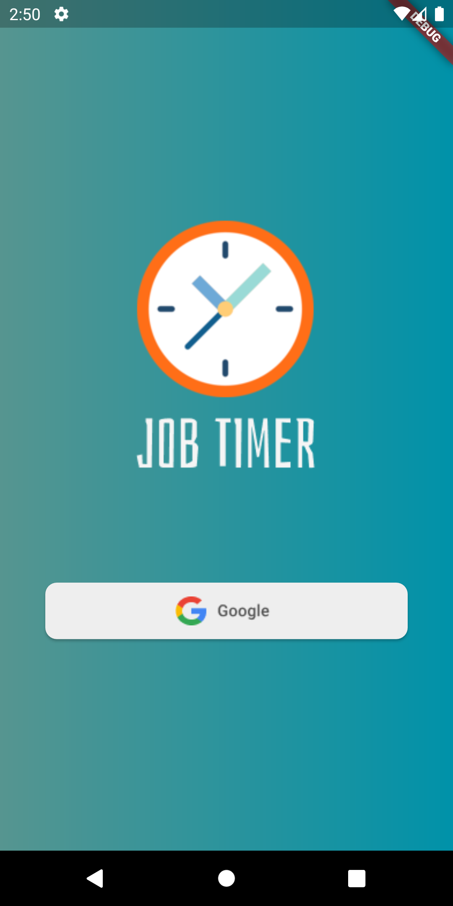
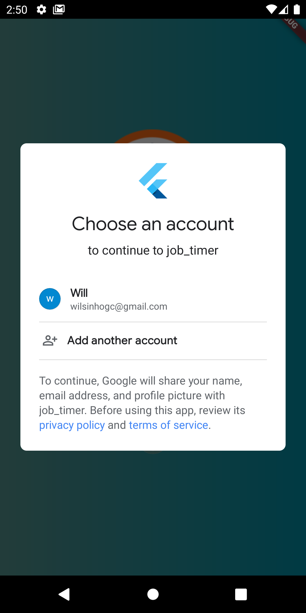
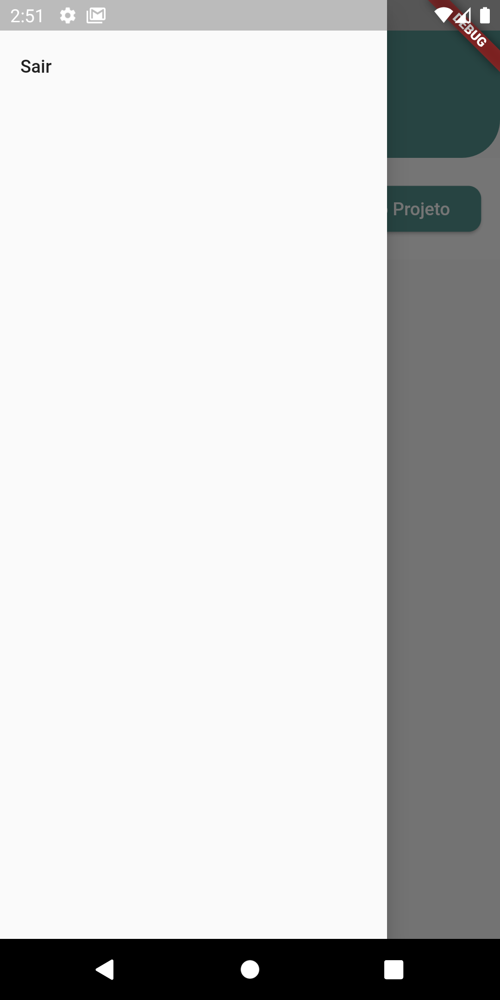
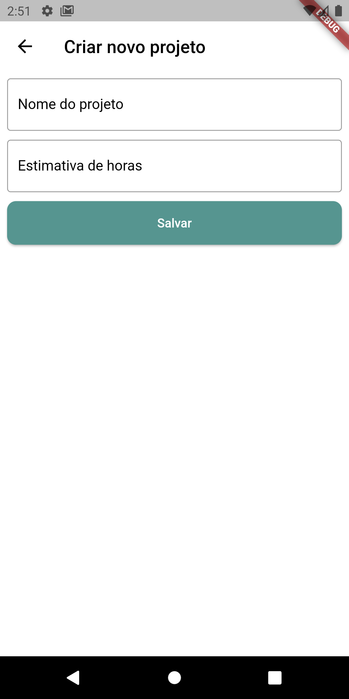
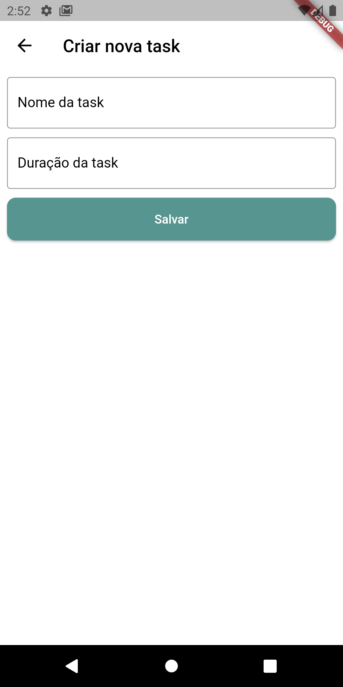
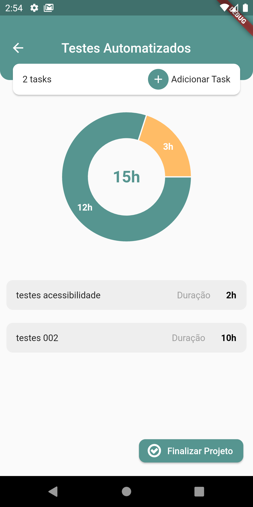

*DartWeek Academia do Flutter
<h1 align="center">Job Timer: </h1>
<h1 align="center">
  </h1>
<h1 align="center">
    <a href="https://pub.dev/">Flutter</a></h1>
	
üöÄ Aplicativo para Gerenciar tempo de projetos com stacks, tecnologias utilizadas (Flutter, Firebase Login, Bloc, Modular, Banco de dados Isar)...

	

</h4>
 <a href="#Descrição">Descrição</a> •
 <a href="#Experiencia">Experiencia</a> •
 <a href="#Features">Features</a> •
 <a href="#Rodar">Rodar</a> • 
 <a href="#Telas">Telas</a> •  

## Descrição

Projeto desenvolvido em Flutter no evento com mentoria de Rodrigo Rahman que é especialista da Academia do Flutter's Dart Week 06/2022. =>
<a href="http://academiadoflutter.com.br//">Rodrigo Rahman</a>
 

## Experiencia
Com este projeto pude desenvolver um app para criar projetos e gerenciar tempo através do registro de tasks.
### Features
- [x] Acesso para novo usu√°rio realizar login
- [x] Cadastro de novos projetos e tasks
- [x] Validação nos campos de preenchimento por todo app
- [x] Gerenciamento de tempo atravez da tela detalhamento das tasks
- [x] Opção de finalizar Projeto
- [x] Status de Andamento e Finalizado
### Rodar
- [x] Fazer Clone do Projeto "git clone https://github.com/willgoncalvescruz/job-timer.git"
- [x] Baixar dependencias "Flutter pub get"
- [x] Fazer Build "Flutter run"
### Telas
<h1 align="center">
  
  
  
  
  
  
  
</h1>